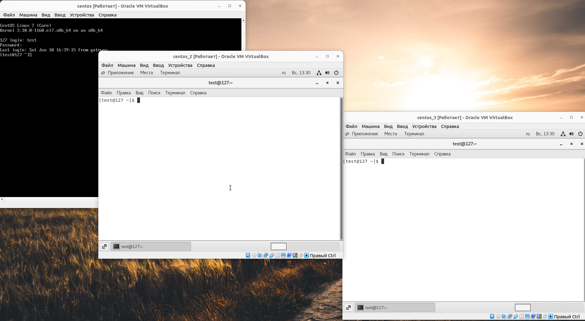
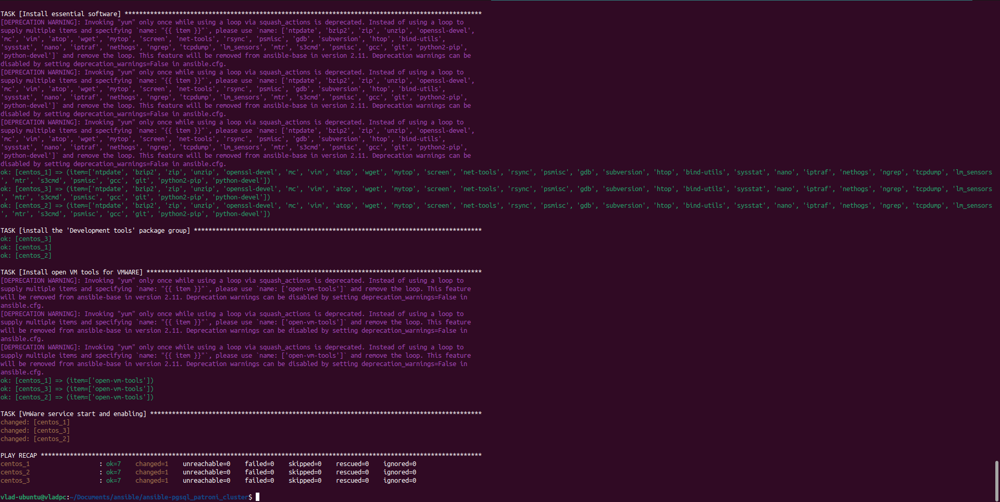

# ansible_postges_patroni_cluster
## Задача: Разработка Ansible сценария

Развертывание кластера PostgreSQL на базе Patroni на нескольких хостах.
ОС хостов - на Ваше усмотрение.
Можно для развертывания использовать существующие артефакты от производителя или сторонние.
После развертывания, кластер должен содержать:
- кастомную БД с именем "Custom" (наличие объектов в БД не обязательно)
- профиль пользователя, отличного от встроенного, владельца БД "Customer"

За основу выполнения данного задания мной была выбрана статья на habr https://habr.com/ru/articles/322036/ В качестве тестовых стендов в vitrualBox было развернуто 3 CentOS 7. 

Для проверки работы скрипта будут полезны следующие команды:

`asible-playbook -i hosts cluster-pgsql.yml --skip-tags patroni --extra-vars "ansible_sudo_pass=root"` - Команда для установки необходимого ПО "Development tools" для работы последующих команд.

`ansible-playbook -i hosts cluster-pgsql.yml --extra-vars "ansible_sudo_pass=root"` - Команда для запуска установки Postgres, Patroni и конфигурирования.

`ssh-copy-id -p 20322 test@127.0.0.1` - данной командой отправил на тестовы стенды ssh ключи для доступа без пароля. По хорошему для данной процедуры лучше использовать отдельную роль если стендов будет много, но в целях экономии времени решил сделать так.

centos_7 тестовые стенды
`ssh -p 20322 test@127.0.0.1`
`ssh -p 20422 test@127.0.0.1`
`ssh -p 20522 test@127.0.0.1`

- <b>На данном скриншоте показаны тестовые стенды<b> 
  
  

- <b>На данном скриншоте показано что необходимое ПО установлено<b> 
  
    